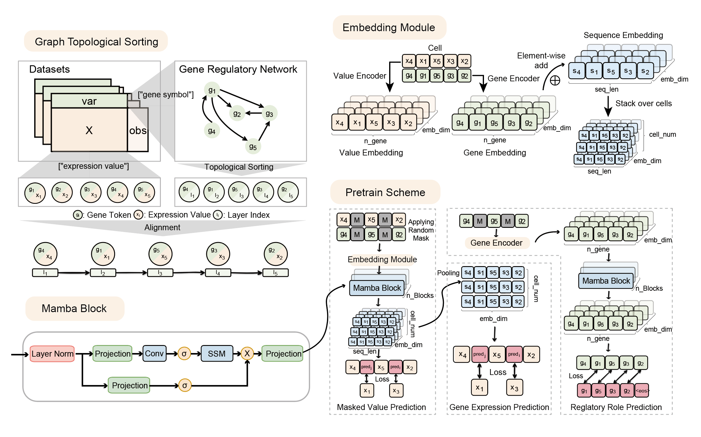

# 🧬 RegFormer: A Single-Cell Foundation Model Powered by Gene Regulatory Network

**RegFormer** is a foundation model designed for large-scale single-cell RNA-seq analysis.  
It integrates **Gene Regulatory Network (GRN)** priors with a **Mamba state-space architecture**, enabling efficient long-sequence modeling and biologically interpretable representation learning across diverse downstream tasks.

---

## 🚀 Key Features

- **GRN-guided pretraining** for biologically grounded representation learning  
- **Mamba-based encoder** for scalable long-gene-sequence modeling  
- **Unified task framework** supporting:
  - 🧫 Cell type annotation  
  - 🧩 Cell embedding generation  
  - ⚙️ Gene regulatory network reconstruction  
  - 💊 Drug response prediction  
  - 🧬 Genetic perturbation modeling  

---

## 📂 Repository Structure

```
RegFormer-Official/
├── Docs/                       # Tutorials and configuration notebooks
│   └── configs/
│       ├── anno.ipynb          # Cell type annotation walkthrough
│       ├── cell_emb.ipynb      # Embedding visualization & evaluation
│       ├── drug.ipynb          # Drug response prediction example
│       ├── grn.ipynb           # GRN reconstruction pipeline
│       ├── pert.ipynb          # Perturbation modeling example
│
├── downstream_task/             # Task-specific training & evaluation scripts
│   ├── __init__.py
│   ├── regformer_pretrain.py    # Main pretraining launcher
│   ├── regformer_emb.py         # Cell embedding task
│   ├── regformer_anno.py        # Cell annotation task
│   ├── regformer_grn.py         # GRN reconstruction task
│   ├── regformer_pert.py        # Perturbation modeling
│   ├── regformer_drug.py        # Drug response prediction
│
├── pytest/                      # Unit tests for each downstream task
│   ├── RegFormer_anno/
│   ├── RegFormer_emb/
│   ├── RegFormer_grn/
│   ├── RegFormer_drug/
│   ├── RegFormer_pert/
│   └── RegFormer_pretrain/
│
├── regformer/                   # Core model implementation
│   ├── data/                    # Dataset loading, preprocessing, MuData I/O
│   ├── graph/                   # GRN construction, motif scanning, remove cycle
│   ├── model/                   # Mamba blocks, encoders, decoders
│   ├── repo/                    # Pretrained checkpoints and registry
│   ├── utils/                   # Helper utilities and logging functions
│   └── __init__.py
│
└── README.md                    # You are here
```

---

## ⚙️ Installation

```bash
git clone https://github.com/BGIResearch/RegFormer
cd RegFormer-Official
conda create -n regformer python=3.9
conda activate regformer
pip install -r requirements.txt
```

---

## 🧠 Pretraining

Run RegFormer pretraining with Mamba backbone:

```bash
python downstream_task/regformer_pretrain.py  pretrain.toml
```

---

## 🔬 Downstream Tasks

Each downstream task can be run independently:

| Task | Script | Example                                                                      |
|------|---------|------------------------------------------------------------------------------|
| Cell Annotation | `regformer_anno.py` | `python downstream_task/regformer_anno.py --config_file anno.toml`           |
| Cell Embedding | `regformer_emb.py` | `python downstream_task/regformer_emb.py --config_file cell_emb.toml` |
| GRN Reconstruction | `regformer_grn.py` | `python downstream_task/regformer_grn.py --config_file grn.toml`     |
| Drug Response Prediction | `regformer_drug.py` | `python downstream_task/regformer_drug.py --config_file drug.toml`   |
| Perturbation Modeling | `regformer_pert.py` | `python downstream_task/regformer_pert.py --config_file pert.toml`       |

---

## 🧩 Model Architecture Overview

RegFormer combines:
- **GRN-guided gene ordering** via topological sorting  
- **Dual embeddings** (gene identity and expression value)  
- **Mamba blocks** integrating convolution, linear recurrence, and SSM modules  
- **Multi-task decoders** (Masked Value Prediction, Topological Prediction, etc.)

This hybrid design improves both biological interpretability and computational efficiency in long-gene-sequence modeling.

---

## 🧪 Testing

Run pytest to validate module functionality:
```bash
pytest -v
```

---

## 📊 Citation

If you use **RegFormer** in your research, please cite:

> Hu, L. et al. *RegFormer: A Single-Cell Foundation Model Powered by Gene Regulatory Network.* (2025)

---

## 📬 Contact

**Author:** Luni Hu, Ph.D.  
**Affiliation:** BGI Research
**Email:** [huluni@bgi.com]  
---

🧠 *RegFormer — Foundation Modeling Meets Gene Regulation*
